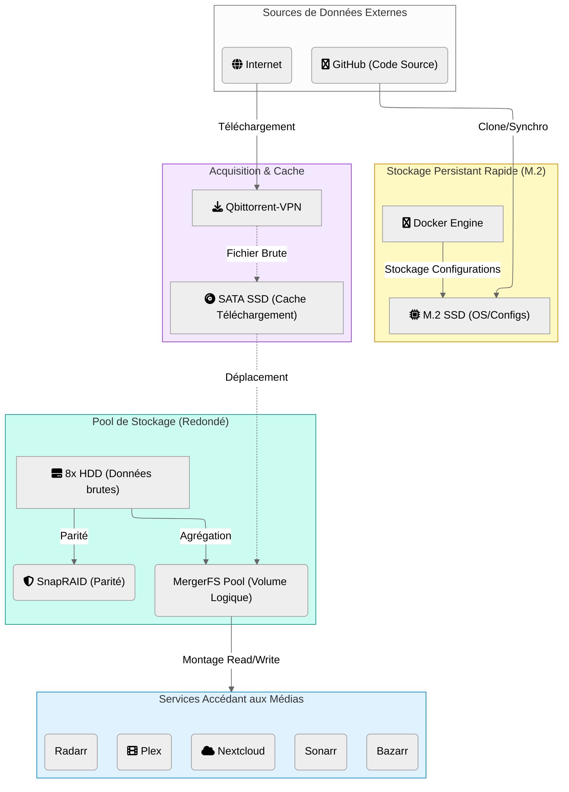

# 🔄 Flux de Données & Stratégie de Stockage

Ce document détaille le cycle de vie de la donnée au sein du serveur, de son acquisition à son archivage. L'architecture repose sur une stratégie de stockage hiérarchisé (Tiering) pour optimiser les performances et la durabilité.

## 💾 Stratégie de Stockage (Tiering)

Le serveur utilise trois types de stockage distincts, chacun adapté à un usage spécifique :

1.  **Hot Storage (M.2 NVMe)** :
    *   **Usage** : Système d'exploitation (Debian), configurations Docker, et bases de données (MariaDB, SQLite).
    *   **Avantage** : Latence ultra-faible et débits élevés pour la réactivité du système et des applications.

2.  **Warm Storage (SATA SSD)** :
    *   **Usage** : Cache d'écriture temporaire et zone de téléchargement.
    *   **Rôle** : Les fichiers sont téléchargés et traités ici avant d'être déplacés vers le stockage de masse. Cela évite de fragmenter les disques durs et permet des décompressions rapides.

3.  **Cold Storage (HDD Pool)** :
    *   **Usage** : Stockage de masse pour les médias (Films, Séries) et les archives.
    *   **Technologie** : **MergerFS** unifie les disques en un seul volume logique, tandis que **SnapRAID** assure la parité (protection contre la panne d'un disque) sans les contraintes d'un RAID classique.

---

## 📊 Diagramme de Flux

