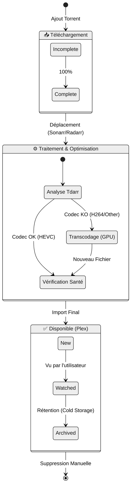

# 🧬 Cycle de Vie du Média (State Diagram)

Ce document illustre les différents états par lesquels passe un fichier vidéo au sein du serveur, depuis son téléchargement initial jusqu'à son archivage final.

## 🔄 États du Fichier

### Explication des États

1.  **Downloading** : Le fichier est physiquement sur le cache SSD (Warm Storage), géré par le client Torrent.
2.  **Processing** : Phase critique où le fichier est renommé, déplacé, et potentiellement transcodé par Tdarr pour respecter les standards (HEVC).
3.  **Available** : Le fichier est propre, optimisé et indexé par Plex. Il réside sur le stockage de masse (Cold Storage).
