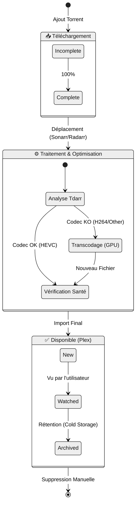

# 🧬 Cycle de Vie du Média (State Diagram)

[↑ Retour au sommaire](./README.md) | [Tdarr workflow →](./tdarrflow.md)

Ce document illustre les différents **états** par lesquels passe un fichier vidéo au sein du serveur, depuis son téléchargement initial jusqu'à son archivage final. C'est une représentation de machine à états finis (FSM) du traitement média.

> 🔄 **Flux automatisé** : Chaque transition est automatisée et supervisée par les services *Arrs et Tdarr.

## 🔄 États du Fichier



### Explication des États

1.  **Downloading** : Le fichier est physiquement sur le cache SSD (Warm Storage), géré par le client Torrent.
2.  **Processing** : Phase critique où le fichier est renommé, déplacé, et potentiellement transcodé par Tdarr pour respecter les standards (HEVC).
3.  **Available** : Le fichier est propre, optimisé et indexé par Plex. Il réside sur le stockage de masse (Cold Storage).

---

## 📊 Détails par État

### 📥 Downloading (Téléchargement)

**Localisation** : `/mnt/cache/downloads/incomplete/`  
**Durée typique** : 10 min - 4h  
**Gestion** : Qbittorrent

**Transitions possibles** :
- → `Processing` : Téléchargement complété à 100%
- → `Error` : Échec de téléchargement (tracker down, ratio, etc.)

### ⚙️ Processing (Traitement)

**Localisation** : `/mnt/cache/downloads/complete/` puis `/mnt/storage/media/`  
**Durée typique** : 20 min - 8h (selon transcodage)  
**Gestion** : Radarr/Sonarr + Tdarr

**Sous-étapes** :
1. **Import Radarr/Sonarr** : Renommage selon pattern
   ```
   Film Name (Year) [Quality-Source].mkv
   Exemple : Inception (2010) [1080p-BluRay].mkv
   ```

2. **Analyse Tdarr** : Vérification codec
   - Si HEVC → Pas de transcodage, passage direct à `Available`
   - Si autre codec → Transcodage HEVC

3. **Health Check** : Vérification intégrité fichier

**Transitions possibles** :
- → `Available` : Traitement réussi
- → `Error` : Fichier corrompu ou transcodage échoué

### ✅ Available (Disponible)

**Localisation** : `/mnt/storage/media/{movies|tv}/`  
**Durée** : Indéfinie (jusqu'à archivage ou suppression)  
**Gestion** : Plex

**Sous-états** :
- **New** : Ajouté récemment (< 30 jours), mis en avant dans Plex
- **Watched** : Visionné au moins une fois par un utilisateur
- **Archived** : Non visionné depuis 6+ mois, candidat à suppression

**Métadonnées** :
- Affiche, synopsis, note (TMDB/IMDB)
- Sous-titres (français, anglais) via Bazarr
- Historique de lecture (Tautulli)

---

## ⏱️ Durées Moyennes

| État | Durée Minimale | Durée Maximale | Moyenne |
|------|----------------|----------------|----------|
| Downloading | 10 min | 4h | 1h |
| Processing | 5 min | 8h | 1h30 |
| Available (New) | 0 jours | 30 jours | 30 jours |
| Available (Watched) | 30 jours | Indéfinie | - |

**Temps total** : Requête → Disponible = **30 min à 12h** (moyenne 2h30)

---

## 🛠️ Dépannage

### Le fichier reste bloqué en "Downloading"

**Causes** :
- Pas assez de seeders
- Problème VPN (killswitch actif sans connexion)
- Espace disque insuffisant

**Solutions** :
```bash
# Vérifier Qbittorrent
docker logs qbittorrent --tail 50

# Vérifier espace disque
df -h /mnt/cache
```

### Le fichier reste bloqué en "Processing"

**Causes** :
- Tdarr occupé avec d'autres tâches
- Fichier corrompu
- Queue Radarr/Sonarr bloquée

**Solutions** :
```bash
# Vérifier Tdarr
docker logs tdarr --tail 50

# Forcer un rescan Radarr
curl -X POST http://radarr:7878/api/v3/command \
  -H "X-Api-Key: YOUR_API_KEY" \
  -d '{"name": "RefreshMovie", "movieId": 123}'
```

---

## 🔗 Voir Aussi

- [Pipeline Tdarr détaillé](./tdarrflow.md)
- [Séquence de requête complète](./media_request_sequence.md)
- [Flux de données](./dataflow.md) - Stratégie de stockage
