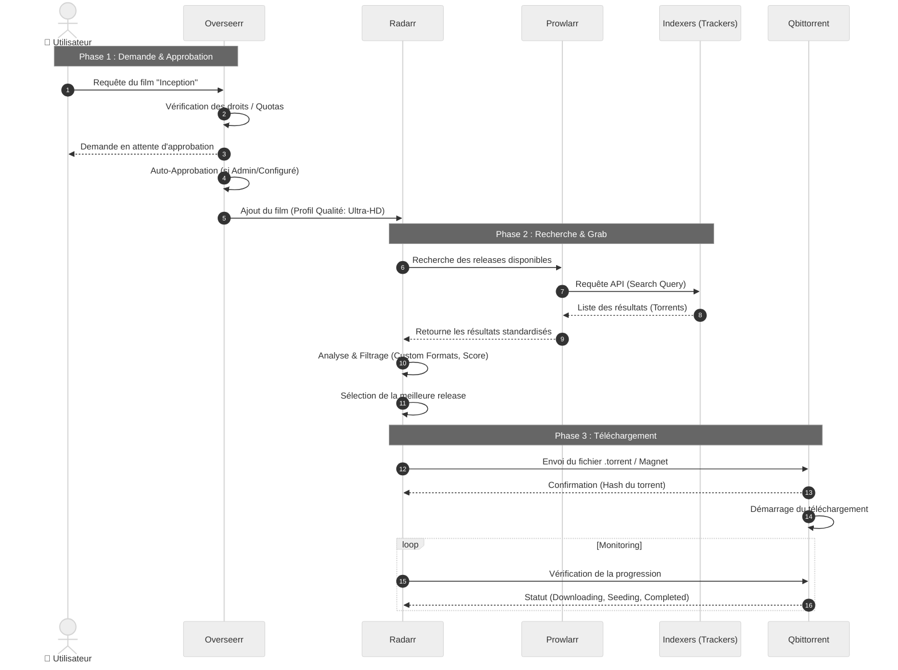

# 🎬 Séquence de Requête Média

Ce document détaille les interactions précises entre les services lorsqu'un utilisateur demande un nouveau contenu. Contrairement au diagramme de flux global, ce diagramme de séquence met l'accent sur l'ordre chronologique et les messages échangés.

## ⏱️ Cycle de Vie d'une Requête

Le diagramme ci-dessous illustre le parcours d'une demande de film, de l'interface utilisateur jusqu'au lancement du téléchargement.

### Points Clés
*   **Prowlarr comme Proxy** : Radarr ne parle jamais directement aux sites de torrents, tout passe par Prowlarr qui standardise les réponses.
*   **Décision Locale** : C'est Radarr qui contient toute la logique de décision (quel fichier prendre ?), Prowlarr ne fait que fournir les options.
*   **Boucle de Monitoring** : Une fois le téléchargement lancé, Radarr surveille activement Qbittorrent pour savoir quand importer le fichier final.
