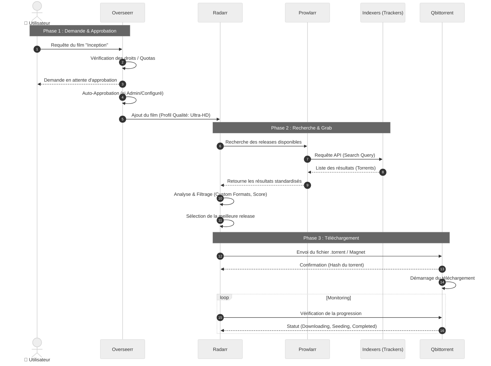

# 🎬 Séquence de Requête Média

[↑ Retour au sommaire](./README.md) | [Workflow global →](./workflow.md)

Ce document détaille les interactions précises entre les services lorsqu'un utilisateur demande un nouveau contenu. Contrairement au diagramme de flux global, ce **diagramme de séquence** met l'accent sur l'**ordre chronologique** et les **messages échangés** entre composants.

> ⏱️ **Durée moyenne** : De la requête à la disponibilité : 30 min - 4h selon la disponibilité du torrent et la taille du fichier.

## ⏱️ Cycle de Vie d'une Requête

Le diagramme ci-dessous illustre le parcours d'une demande de film, de l'interface utilisateur jusqu'au lancement du téléchargement.



### Points Clés
*   **Prowlarr comme Proxy** : Radarr ne parle jamais directement aux sites de torrents, tout passe par Prowlarr qui standardise les réponses.
*   **Décision Locale** : C'est Radarr qui contient toute la logique de décision (quel fichier prendre ?), Prowlarr ne fait que fournir les options.
*   **Boucle de Monitoring** : Une fois le téléchargement lancé, Radarr surveille activement Qbittorrent pour savoir quand importer le fichier final.

---

## 🔍 Détails des Étapes

### Étape 1-3 : Demande Utilisateur

**Durée** : < 1 seconde  
**Actions** :
- Vérification des quotas utilisateur (limite de requêtes/mois)
- Vérification si le contenu n'est pas déjà disponible
- Notification email/Discord (optionnel)

### Étape 4-7 : Recherche Indexeurs

**Durée** : 5-15 secondes  
**Indexeurs interrogés** : YGG, 1337x, RARBG, etc.  
**FlareSolverr** : Contourne Cloudflare pour les sites protégés

**Exemple de requête** :
```
GET /api/v1/search?query=Inception&categories=movies
```

### Étape 8-10 : Sélection & Filtrage

**Critères de sélection** :
1. **Profil de qualité** : Ultra-HD > HD-1080p > HD-720p
2. **Custom Formats** : Préférence REMUX > WEB-DL > BluRay
3. **Taille fichier** : < 50 Go (limite configurable)
4. **Seeders** : > 5 (pour garantir une bonne vitesse)
5. **Score** : Calculé selon les préférences

### Étape 11-13 : Téléchargement

**Durée** : 10 min - 4h selon taille et connexion  
**Localisation** : Cache SSD (Warm Storage)  
**Bande passante** : Limitée à 80% de la connexion (configurable)

### Étape 14-15 : Monitoring

**Fréquence** : Toutes les 30 secondes  
**Statuts possibles** :
- `Downloading` : Téléchargement en cours
- `Seeding` : Téléchargement terminé, partage actif
- `Completed` : Prêt pour import
- `Error` : Échec (ratio, tracker down, etc.)

---

## 📡 Notifications

L'utilisateur reçoit des notifications à chaque étape clé :

1. **Demande approuvée** (immédiat)
2. **Téléchargement démarré** (< 30s)
3. **Téléchargement terminé** (variable)
4. **Import terminé - Disponible sur Plex** (+ 10-30 min post-download)

---

## 🔗 Voir Aussi

- [Workflow global](./workflow.md) - Vue d'ensemble complète
- [Cycle de vie du média](./media_lifecycle_state.md) - États du fichier
- [Applications](./02_applications.md) - Configuration des services
