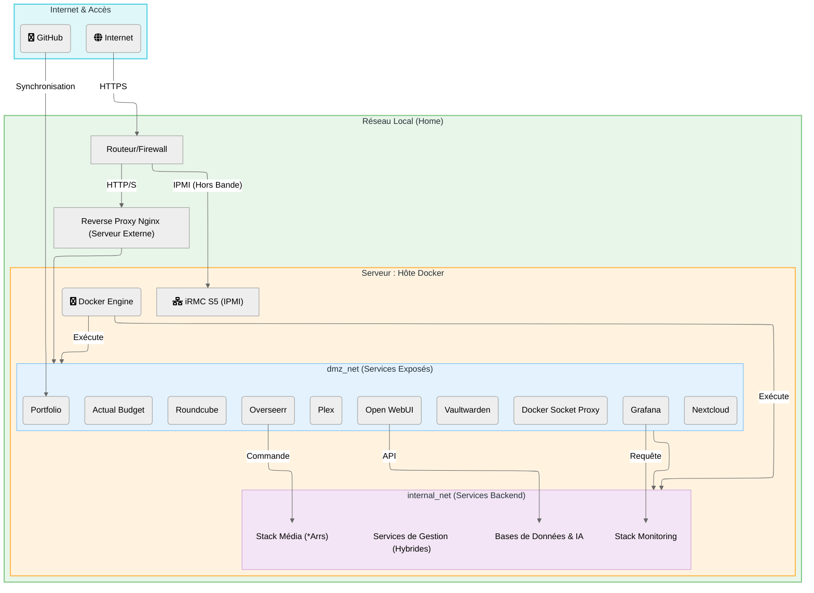

# 🌐 Flux de Réseau

Ce document illustre la segmentation réseau du serveur, conçue pour isoler les services exposés des services critiques internes.

## 🛡️ Segmentation Réseau

Le réseau est divisé en plusieurs zones de confiance :

1.  **DMZ (Zone Démilitarisée)** :
    *   **Rôle** : Héberge les services accessibles depuis l'extérieur (via Reverse Proxy).
    *   **Sécurité** : Isolée du réseau interne critique. Si un service ici est compromis, l'accès au reste du système reste limité.

2.  **Internal Net (Backend)** :
    *   **Rôle** : Héberge les bases de données, les services *Arrs (Radarr, Sonarr), et les outils de monitoring.
    *   **Sécurité** : Non accessible directement depuis internet. Seuls les services de la DMZ peuvent y accéder via des règles strictes.

3.  **Host & Local Network** :
    *   **Rôle** : Le serveur physique et le réseau domestique.
    *   **Accès** : Gestion via SSH ou IPMI (hors bande) pour l'administration système.

---

## 📊 Diagramme de Flux

