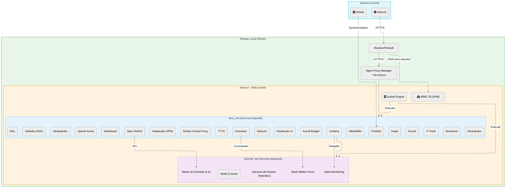

# 🌐 Flux de Réseau

[↑ Retour au sommaire](./README.md) | [Infrastructure →](./01_infrastructure.md)

Ce document illustre la **segmentation réseau** du serveur, conçue pour isoler les services exposés des services critiques internes selon le principe de **défense en profondeur** (Defense in Depth).

> 🛡️ **Sécurité** : En cas de compromission d'un service exposé (DMZ), l'accès aux services backend critiques reste protégé par l'isolation réseau.

## 🛡️ Segmentation Réseau

Le réseau est divisé en plusieurs zones de confiance :

1.  **DMZ (Zone Démilitarisée)** :
    *   **Rôle** : Héberge les services accessibles depuis l'extérieur (via Reverse Proxy).
    *   **Sécurité** : Isolée du réseau interne critique. Si un service ici est compromis, l'accès au reste du système reste limité.

2.  **Internal Net (Backend)** :
    *   **Rôle** : Héberge les bases de données, les services *Arrs (Radarr, Sonarr), et les outils de monitoring.
    *   **Sécurité** : Non accessible directement depuis internet. Seuls les services de la DMZ peuvent y accéder via des règles strictes.

3.  **Host & Local Network** :
    *   **Rôle** : Le serveur physique et le réseau domestique.
    *   **Accès** : Gestion via SSH ou IPMI (hors bande) pour l'administration système.

---

## 📊 Diagramme de Flux



---

## 🔐 Règles de Sécurité Réseau

### Flux Autorisés

| Source | Destination | Ports | Protocole | Usage |
|--------|-------------|-------|-----------|-------|
| **Internet** | DMZ | 80, 443 | HTTPS | Accès web via reverse proxy |
| **DMZ** | Internal Net | Variés | TCP | API backends, DB |
| **Internal Net** | DMZ | - | - | **❌ Bloqué** (unidirectionnel) |
| **LAN Local** | iRMC | 443 | HTTPS | Gestion hors-bande |
| **LAN Local** | Host SSH | 22 | SSH | Administration |

### Isolation par Zone

#### 🟢 DMZ (Zone Exposée)

**Services** : Plex, Overseerr, Nextcloud, Grafana, Vaultwarden, Open WebUI, Dashboard, Authelia, Headscale, Headscale UI, Kopia, MediaWiki, Uptime Kuma, Dozzle, Glances, IT-Tools, TTYD  
**Accès** : Internet → Reverse Proxy → DMZ  
**Restriction** : Pas d'accès direct aux services backend

#### 🟡 Internal Net (Backend)

**Services** : Bases de données, *Arrs, Qbittorrent, Prometheus, Ollama, Redis  
**Accès** : Uniquement depuis DMZ ou Host  
**Restriction** : Aucun accès depuis Internet

#### 🟠 Host Network

**Services** : Docker Engine, SSH, iRMC  
**Accès** : LAN local uniquement  
**Restriction** : Pas d'exposition Internet directe

---

## 🔒 Best Practices Appliquées

### 1️⃣ Principe du Moindre Privilège

Chaque service n'a accès qu'aux ressources strictement nécessaires.

### 2️⃣ Défense en Profondeur

Plusieurs couches de sécurité :
- Firewall externe (Box/Routeur)
- Reverse Proxy (Nginx avec TLS)
- Segmentation réseau Docker
- VPN pour le trafic P2P
- Socket Proxy pour Docker API

### 3️⃣ Monitoring Continu

Grafana surveille les connexions anormales et les pics de trafic.

---

## 🔧 Configuration Docker Networks

```yaml
networks:
  dmz_net:
    driver: bridge
    ipam:
      config:
        - subnet: 172.19.0.0/16
  
  internal_net:
    driver: bridge
    internal: true  # Pas d'accès Internet direct
    ipam:
      config:
        - subnet: 172.18.0.0/16
```

---

## 🔗 Voir Aussi

- [Infrastructure matérielle](./01_infrastructure.md) - Détails interfaces réseau
- [Sécurité & DRP](./03_maintenance_drp.md) - VPN, Socket Proxy
- [Applications](./02_applications.md) - Attribution des réseaux par service