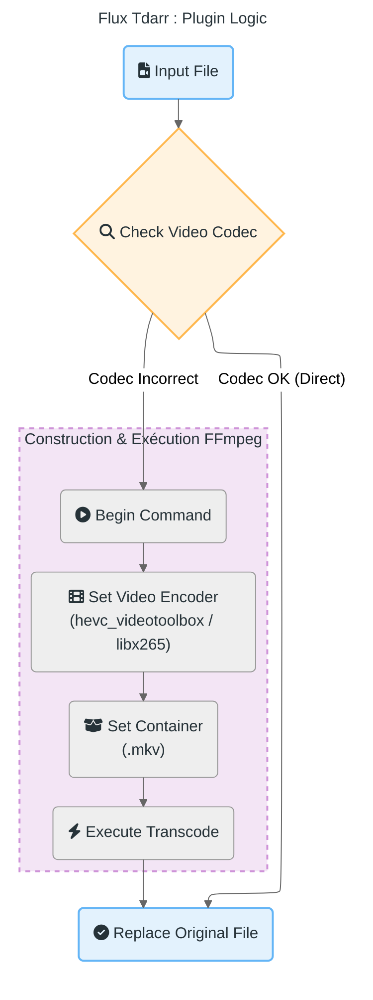

# 🔄 Flux de Travail Tdarr

Ce document détaille le pipeline de traitement vidéo automatisé géré par Tdarr. L'objectif est de standardiser tous les médias pour assurer une compatibilité maximale (Direct Play) et réduire l'espace de stockage.

## 🎬 Pipeline de Transcodage

Le flux de travail suit une logique conditionnelle stricte :

1.  **Analyse (Health Check)** :
    *   Chaque nouveau fichier est analysé pour vérifier son codec vidéo.
    *   **Cible** : HEVC (H.265) dans un conteneur MKV.

2.  **Transcodage (Si nécessaire)** :
    *   Si le fichier n'est pas en HEVC, Tdarr lance une tâche de transcodage.
    *   **Outil** : FFmpeg est utilisé avec l'accélération matérielle (si disponible sur le nœud) ou logicielle (libx265).

3.  **Remplacement** :
    *   Une fois le transcodage réussi, le fichier original est remplacé par la version optimisée.

---

## 📊 Diagramme de Flux

