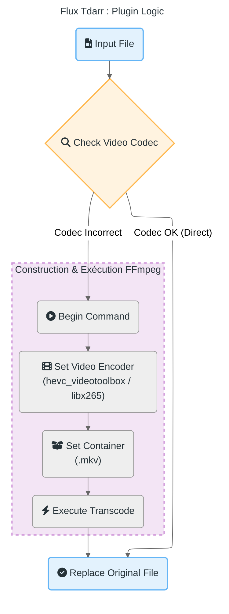

# 🔄 Flux de Travail Tdarr

[↑ Retour au sommaire](./README.md) | [Cycle de vie média →](./media_lifecycle_state.md)

Ce document détaille le pipeline de **traitement vidéo automatisé** géré par Tdarr. L'objectif est de standardiser tous les médias en HEVC (H.265) pour assurer une compatibilité maximale (Direct Play) tout en réduisant l'espace de stockage.

> 🎬 **Gain moyen** : 40-60% de réduction d'espace avec HEVC vs H.264 à qualité visuelle équivalente.

## 🎬 Pipeline de Transcodage

Le flux de travail suit une logique conditionnelle stricte :

1.  **Analyse (Health Check)** :
    *   Chaque nouveau fichier est analysé pour vérifier son codec vidéo.
    *   **Cible** : HEVC (H.265) dans un conteneur MKV.

2.  **Transcodage (Si nécessaire)** :
    *   Si le fichier n'est pas en HEVC, Tdarr lance une tâche de transcodage.
    *   **Outil** : FFmpeg est utilisé avec l'accélération matérielle (si disponible sur le nœud) ou logicielle (libx265).

3.  **Remplacement** :
    *   Une fois le transcodage réussi, le fichier original est remplacé par la version optimisée.

---

## 📊 Diagramme de Flux



---

## ⚙️ Configuration Tdarr

### Plugin Utilisé

**Nom** : `Migz-Transcode to H265/HEVC MKV`  
**Stratégie** : Transcoder uniquement si nécessaire (codec != HEVC)

### Paramètres de Transcodage

```javascript
// Configuration du plugin
{
  "container": ".mkv",
  "video_codec": "hevc",
  "encoder": "hevc_videotoolbox",  // M4 Mac
  "encoder_fallback": "libx265",    // CPU serveur
  "audio_codec": "copy",            // Pas de réencodage audio
  "subtitle_codec": "copy",         // Conserver les sous-titres
  "crf": 23,                         // Qualité (18-28, plus bas = meilleur)
  "preset": "medium"                 // Équilibre vitesse/qualité
}
```

### Architecture Distribuée

| Nœud | CPU/GPU | Vitesse | Usage |
|-------|---------|---------|-------|
| **Serveur (Interne)** | Intel Xeon (CPU) | ~0.5x realtime | Fichiers < 5 Go |
| **MacBook M4 (Externe)** | VideoToolbox (GPU) | ~2-3x realtime | Fichiers > 5 Go |

> ⚡ **Performance** : Le M4 transconde un film 4K (20 Go) en ~30-45 min vs 3-4h sur CPU.

---

## 📊 Statistiques

### Gains d'Espace

| Format Original | Taille | Format HEVC | Taille | Gain |
|-----------------|--------|-------------|--------|------|
| Film 1080p H.264 | 8 Go | HEVC | 4.5 Go | **43%** |
| Série 1080p H.264 | 2 Go/épisode | HEVC | 1.1 Go | **45%** |
| Film 4K H.264 | 25 Go | HEVC | 14 Go | **44%** |

**Gain total médiathèque** : ~12 To → 7 To = **5 To économisés**

### Qualité Visuelle

- **VMAF Score** : 95+ (indistinguable de l'original)
- **Bitrate moyen** : 8-12 Mbps (1080p), 20-30 Mbps (4K)
- **Compatibilité** : 100% Direct Play sur clients modernes (2016+)

---

## 🛠️ Dépannage

### Le transcodage échoue

**Cause probable** : Fichier corrompu ou codec non supporté  
**Solution** : Vérifier les logs Tdarr, réessayer avec `libx265` (CPU)

### Fichier remplacé mais de moins bonne qualité

**Cause** : CRF trop élevé (> 25)  
**Solution** : Ajuster le CRF à 21-23 dans le plugin

### Le nœud externe ne se connecte pas

**Cause** : Pare-feu ou IP incorrecte  
**Solution** : Vérifier `tdarr_server:8266` accessible depuis le Mac

---

## 🔗 Voir Aussi

- [Cycle de vie du média](./media_lifecycle_state.md) - États complets du fichier
- [Flux de données](./dataflow.md) - Stratégie de stockage
- [Workflow global](./workflow.md) - Intégration dans l'écosystème