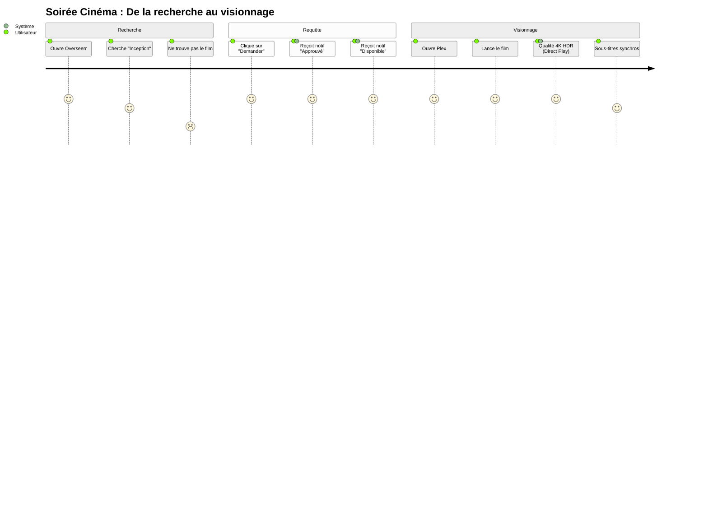

# 🗺️ Parcours Utilisateur (User Journey)

Ce document illustre l'expérience d'un utilisateur type sur le serveur, mettant en avant les interactions émotionnelles et les étapes clés de l'utilisation des services.

## 🍿 Scénario : Soirée Cinéma

### Analyse du Parcours

*   **Points de friction potentiels** : Si le film n'est pas trouvé immédiatement ou si le téléchargement est long (note de 2 lors de la recherche infructueuse).
*   **Points forts** : L'automatisation des notifications et la qualité du streaming (Direct Play) garantissent une satisfaction élevée (note de 5) une fois le contenu disponible.
