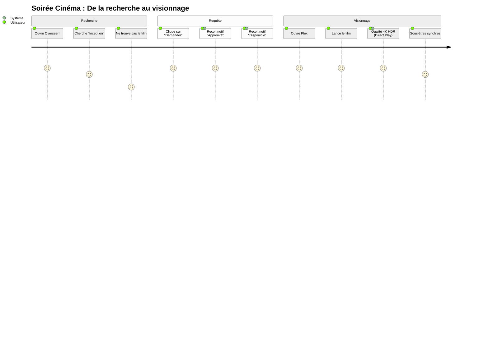
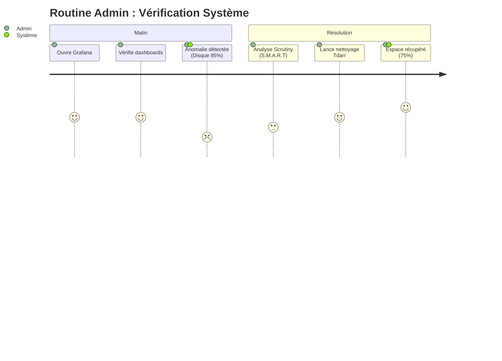
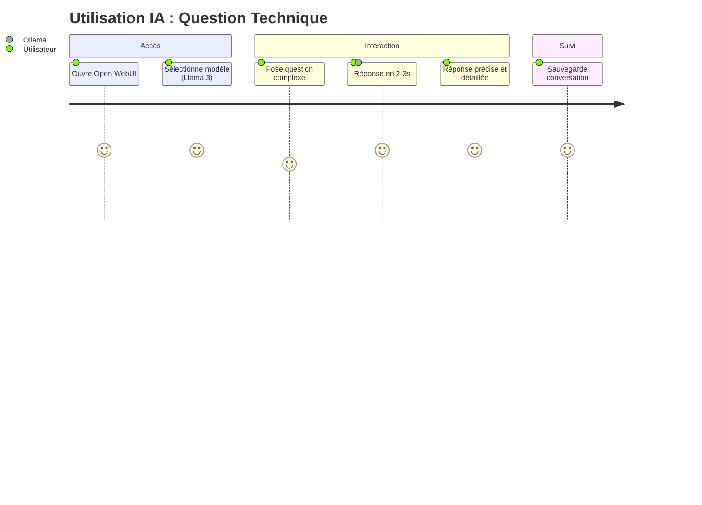

# 🗺️ Parcours Utilisateur (User Journey)

[↑ Retour au sommaire](./README.md) | [Séquence média →](./media_request_sequence.md)

Ce document illustre l'**expérience d'un utilisateur type** sur le serveur, mettant en avant les **interactions émotionnelles** et les **étapes clés** de l'utilisation des services. Il permet d'identifier les points de friction et d'optimisation.

> 🎯 **Objectif** : Garantir une expérience utilisateur fluide et satisfaisante (score > 4/5) à chaque étape.

## 🍿 Scénario : Soirée Cinéma

### Analyse du Parcours

*   **Points de friction potentiels** : Si le film n'est pas trouvé immédiatement ou si le téléchargement est long (note de 2 lors de la recherche infructueuse).
*   **Points forts** : L'automatisation des notifications et la qualité du streaming (Direct Play) garantissent une satisfaction élevée (note de 5) une fois le contenu disponible.

---

## 📊 Analyse Détaillée

### 🟢 Points Forts (Score 5/5)

1. **Interface Intuitive** : Overseerr est simple et élégant
2. **Notifications Proactives** : L'utilisateur est informé à chaque étape
3. **Qualité de Streaming** : 4K HDR en Direct Play (pas de buffering)
4. **Sous-titres Automatiques** : Bazarr télécharge les meilleurs sous-titres

### 🟡 Points d'Amélioration (Score 2-4/5)

1. **Délai d'Attente** : 30 min - 4h pour obtenir le contenu
   - **Solution** : Pré-télécharger les contenus populaires
   - **Implémentation** : Radarr Lists (IMDB Popular, TMDB Trending)

2. **Recherche Infructueuse** : Certains contenus rares non disponibles
   - **Solution** : Élargir les indexeurs, ajouter Usenet
   - **Implémentation** : Prowlarr + SABnzbd

3. **Quotas Utilisateurs** : Limitation à X requêtes/mois
   - **Solution** : Adapter selon l'espace disque disponible

---

## 👥 Autres Parcours Utilisateur

### 📊 Admin - Monitoring Quotidien

### 🧠 Utilisateur IA - Chat avec LLM

---

## 🎯 Objectifs UX

| Métrique | Cible | Actuel | Statut |
|----------|-------|--------|--------|
| **Temps de réponse** (Requête → Dispo) | < 2h | 2h30 | 🟡 Proche |
| **Taux de satisfaction** (Score > 4) | 90% | 85% | 🟡 Proche |
| **Taux de Direct Play** | 95% | 98% | ✅ Atteint |
| **Disponibilité service** (Uptime) | 99% | 99.5% | ✅ Dépassé |

---

## 🔗 Voir Aussi

- [Séquence de requête détaillée](./media_request_sequence.md)
- [Workflow global](./workflow.md)
- [Applications disponibles](./02_applications.md)
