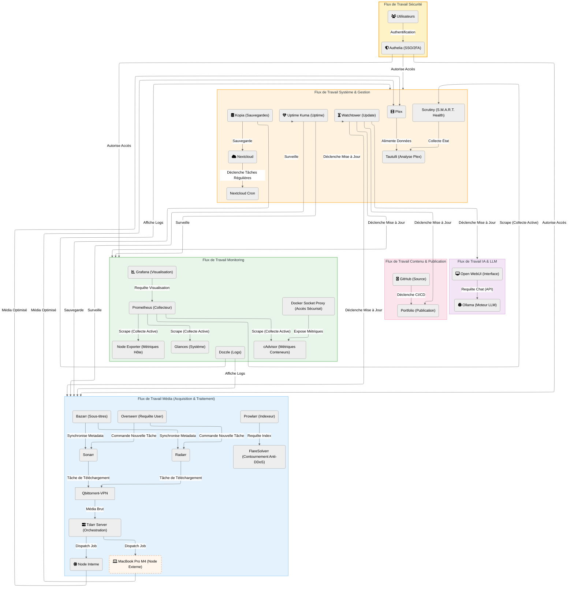

# 🔄 Flux de Travail

[↑ Retour au sommaire](./README.md)

Ce document offre une vue d'ensemble de l'automatisation globale du serveur. Il connecte les différents services pour former un écosystème cohérent et autonome, orchestrant les flux de données et les processus.

> 💡 **Conseil** : Ce diagramme est idéal pour comprendre comment les services interagissent entre eux. Pour des détails spécifiques, consultez les diagrammes dédiés.

## ⚙️ Orchestration des Flux

L'automatisation est divisée en quatre domaines principaux :

1.  **Automation Média (Acquisition)** :
    *   De la requête de l'utilisateur (Overseerr) au téléchargement (Client Torrent) et à l'organisation des fichiers (*Arrs).
    *   Inclut le post-traitement via Tdarr pour l'optimisation.

2.  **Intelligence Artificielle (IA)** :
    *   Intégration de modèles de langage locaux (Ollama) accessibles via une interface web (Open WebUI).

3.  **Maintenance & Système** :
    *   Mises à jour automatiques des conteneurs (Watchtower), sauvegardes et tâches planifiées (Nextcloud Cron).

4.  **Observabilité (Monitoring)** :
    *   Collecte de métriques en temps réel (Prometheus) et visualisation (Grafana) pour surveiller la santé du serveur.

---

## 📊 Diagramme de Flux

---

## 📝 Détails des Flux

### 🎬 Flux Média (Automation)

**Déclencheur** : Requête utilisateur via Overseerr  
**Durée moyenne** : 30 min - 4h  
**Services impliqués** : Overseerr → Radarr/Sonarr → Prowlarr → Qbittorrent → Tdarr → Plex

**Étapes clés** :
1. L'utilisateur cherche un contenu sur Overseerr
2. Overseerr notifie Radarr/Sonarr de la demande
3. Prowlarr recherche sur les indexeurs (via FlareSolverr si nécessaire)
4. Radarr/Sonarr sélectionne la meilleure release et envoie à Qbittorrent
5. Une fois téléchargé, le fichier est déplacé et traité par Tdarr
6. Le média optimisé est indexé par Plex
7. Bazarr télécharge les sous-titres automatiquement

### 🧠 Flux IA

**Déclencheur** : Requête utilisateur via Open WebUI  
**Latence** : < 2s (selon le modèle)  
**Services impliqués** : Open WebUI → Ollama

**Modèles disponibles** : Llama 3, Mistral, CodeLlama, etc.

### 🔧 Flux Maintenance

**Fréquence** : Continue (Watchtower : toutes les 6h)  
**Supervision** : Prometheus + Grafana  
**Services impliqués** : Watchtower, Scrutiny, Tautulli, Nextcloud Cron

### 📊 Flux Monitoring

**Architecture** : Pull-based (Prometheus scrape)  
**Rétention** : 15 jours  
**Services impliqués** : Prometheus ← cAdvisor / Node Exporter / Scrutiny  
**Visualisation** : Grafana avec dashboards pré-configurés

---

## 🔗 Voir Aussi

- **Architecture détaillée** :
  - [Séquence de requête média](./media_request_sequence.md)
  - [Cycle de vie du média](./media_lifecycle_state.md)
  - [Pipeline Tdarr](./tdarrflow.md)

- **Infrastructure** :
  - [Flux réseau](./networkflow.md)
  - [Flux de données](./dataflow.md)
  - [Matériel](./01_infrastructure.md)

- **Gestion** :
  - [Applications](./02_applications.md)
  - [Maintenance](./03_maintenance_drp.md)